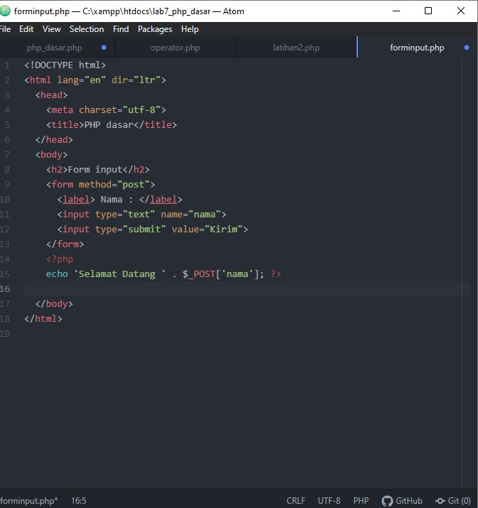

# lab7php
# bagus tri handono - 312010170
# 20.TI.B1
============================================================= 
belajar dasar-dasar php 
php dasar link code=>[dasar php](php/php_dasar.php) 
 
maka tampilan browser 
 
Predefine Variable $_GET link code=>[dasar2](php/latihan2.php) 
 
maka tampilan browser 
untuk mengakesnya gunakan [link ini](http://localhost/lab7_php_dasar/latihan2.php?nama=Agung)
 
membuat form input link code=>[dasar php](php/forminput.php) 
 
maka tampilan browser 
 
Operator pada PHP link code=>[dasar php](php/operator.php) 
 
maka tampilan browser 
 
membuat kondisi IF dan Switch link code=>[dasar php](php/operator.php) 
 
maka tampilan browser 
 
membuat perulangan FOR,WHILE,dan DOWHILE link code=>[dasar php](php/operator.php) 
 
maka tampilan browser 
 

tugas 
Pertanyaan dan Tugas 
Buatlah program PHP sederhana dengan menggunakan form input yang menampilkan nama,  tanggal lahir dan pekerjaan. Kemudian tampilkan outputnya dengan menghitung umur  berdasarkan inputan tanggal lahir. Dan pilihan pekerjaan dengan gaji yang berbeda-beda sesuai pilihan pekerjaan. 
link code =>> [code](php/tugas.php) 
screenshoot setelah dijalankan 

